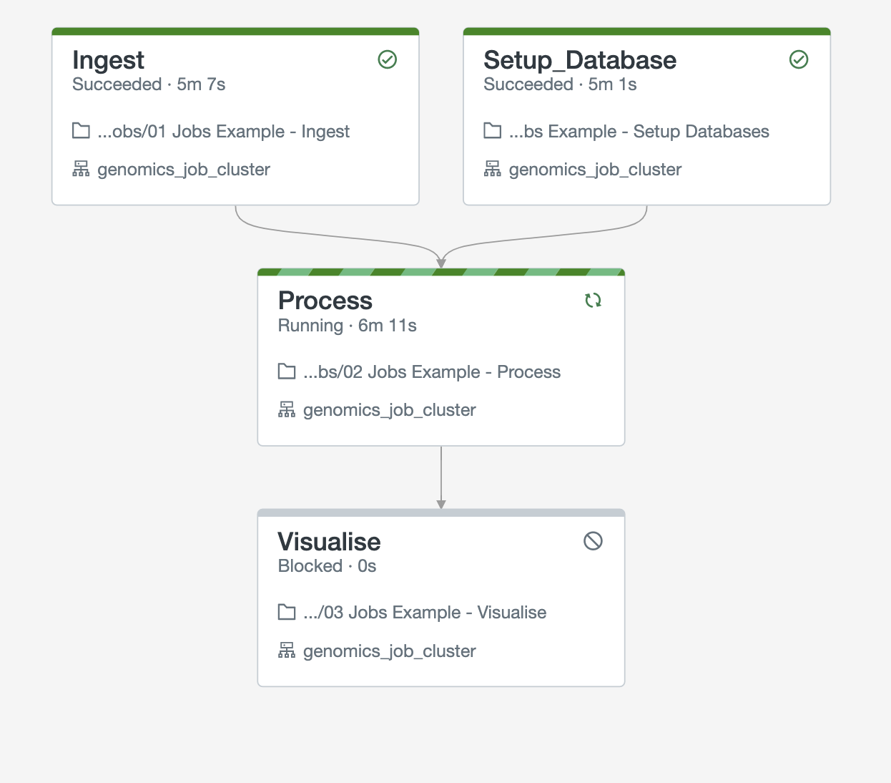

# Variant-Spark Azure Databricks Deployment

This is a small project which automates the deployment
of Variant Spark within Databricks. This produces the
following artifacts:

1. A repository link to: https://github.com/davidglevy/variant-spark-examples
2. A repository link to: https://github.com/microsoft/genomicsnotebook
3. A cluster with library configuration to run VariantSpark
4. An example data pipeline to run variant spark

If all goes well, you will create the multi-task job pipeline above.

# Pre-requisites

Before running terraform please ensure:

1. You have installed the Azure CLI
2. You have logged in with "az login"
3. You have installed terraform

# Getting Started

Within the terraform sub directory:

1. Run `terraform init`
2. Run `terraform apply --var databricks_workspace_url=https://adb-<<YOUR WORKSPACE ID>>.azuredatabricks.net 
3. Assuming all has worked, log into the workspace, and run the job called, "variant-spark-examples-job-<<YOUR USERNAME>>"

